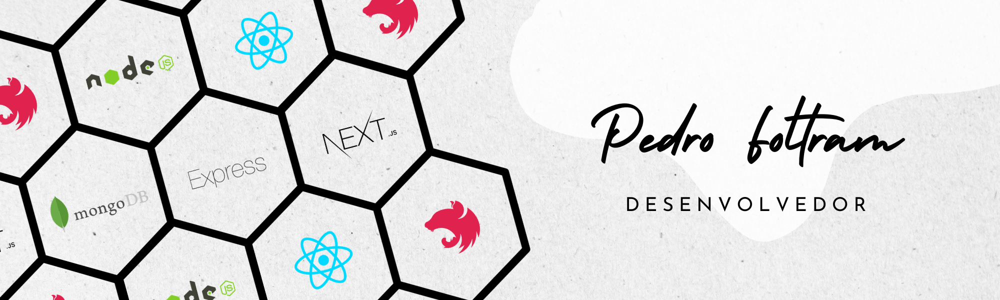

<!-- Banner -->

<!-- About me -->

## 👩‍💻 Quem sou eu 👩‍💻

Olá! Meu nome é Pedro. sou Desenvolvedor Web Pleno na [InMeta](https://www.inmeta.com.br/). Graduado em Análise e Desenvolvimento de Sistemas na [UNIESP](https://www.iesp.edu.br/portal) e estudante de Engenharia da Computação na [Universidade Federal da Paraíba](https://ufpb.br).

## O que vc vai encontrar no meu Github?

Meus repositórios mostram minha evolução até hoje, desde os primeiros códigos.

👩‍💻 Meus projetos focados em apredizagem de um ou mais temas.

📑️ Meus trabalhos da faculdade.

🖥️ Alguns códigos aleatórios.

## 🌟 Tecnologias que estou utilizando mais no momento 🌟

## ⭐ Tecnologias que eu já estudei ⭐

## 📊 Status sobre o que eu ando fazendo por aqui 📊

<!-- GitHub Stats -->

  

<!--  -->

## ⭐ Minhas Redes ⭐

<!-- Social Links -->

 
  
  
  
   

